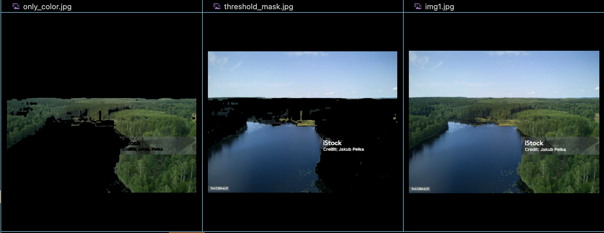

# Image Masking using OpenCV

This Python script demonstrates how to perform color-based image masking using OpenCV library. In this example, we extract a specific color range (green) from an input image and create a binary mask to highlight only the desired color.

## Prerequisites

Before running the script, ensure you have the following installed:
- Python (version 3.x)
- OpenCV library (install via `pip install opencv-python`)

## Usage

1. Clone the repository or download the script file (`threshildMask.py`).

2. Place an image file named `img.jpg` in the same directory as the script. This will be the input image for the masking process.

3. Run the script by executing the following command in your terminal or command prompt:

4. After execution, the script will generate an output image named `threshold_mask.jpg`, which contains the masked image with the desired color highlighted.

## Code Explanation

- The script first loads the input image using OpenCV's `imread` function.
- It then converts the image from the BGR color space to the HSV color space using `cvtColor` function.
- Define the lower and upper boundaries of the color range to be masked (green color in this example) using numpy arrays.
- Generate a binary mask using `inRange` function to filter out pixels within the specified color range.
- Convert the binary mask to a color mask using `cvtColor` function.
- Finally, subtract the color mask from the original image using `subtract` function to obtain the masked image, and save it as `threshold_mask.jpg`.

## Example

## Author

[Your Name]

Feel free to reach out for any questions or improvements!
