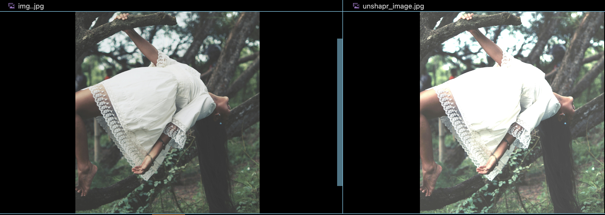

## Unsharp Mask Image Enhancement with OpenCV

Enhance the details and edges of an image using the unsharp mask filter with this simple Python script powered by OpenCV.

# Table of Contents
-----------------

*   [Overview](#overview)
*   [Prerequisites](#prerequisites)
*   [Installation](#installation)
*   [Usage](#usage)
*   [Example](#example)
*   [Contributing](#contributing)
*   [License](#license)

- This Python script unsharp.py applies an unsharp mask filter to an input image, img.jpg, to enhance the image's details and edges. The resulting enhanced image is saved as unsharpened_image.jpg.

## Prerequisites
- Ensure you have the following installed on your system:

- Python 3.11
- OpenCV (cv2)

## Installation
- Clone the Repository
git clone https://github.com/yahyagoorakani/unsharpMask.git
cd unsharpMask

- Install Required Packages
- pip install opencv-python

## Usage

- python unsharp.py

## Example

## Contributing
- Contributions are welcome! Please follow these steps to contribute:

- Fork the repository.
- Create a new branch: git checkout -b feature/your-feature-name.
- Make your changes and commit them: git commit -m 'Add your feature'.
- Push to the branch: git push origin feature/your-feature-name.
- Open a pull request.
