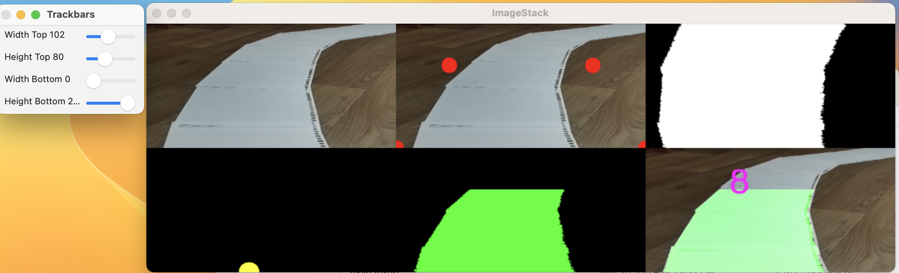
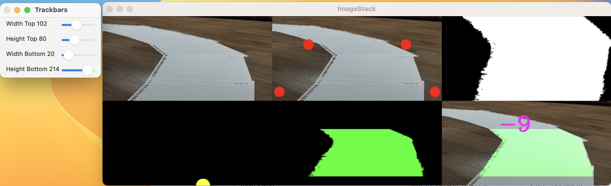

# Lane Detection Project

This project implements a lane detection system using computer vision techniques.

## Overview

The lane detection system is designed to analyze images or videos captured from a vehicle's perspective and identify lane markings on the road. It employs various image processing techniques such as thresholding, perspective transformation, and histogram analysis to achieve accurate lane detection.

## Features

- Thresholding: Converts images to binary format to isolate lane markings.
- Perspective Transformation: Corrects the perspective of the image to a top-down view for easier analysis.
- Histogram Analysis: Identifies lane markings by analyzing pixel intensities along the horizontal axis.
- Smoothing: Smoothens the detected lane curve using a moving average filter.
- Visualization: Provides visual feedback of the lane detection process, including intermediate results and final lane overlay on the original image.

## Installation

1. Clone the repository:

2. Install dependencies:

## Usage

1. Ensure Python and OpenCV are installed on your system.
2. Run the `laneDetection.py` script:

3. Adjust trackbars to fine-tune lane detection parameters if necessary.

## Examples

## License

